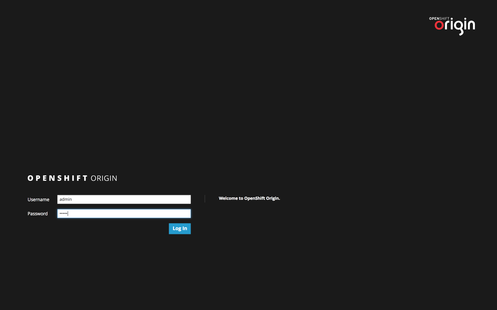
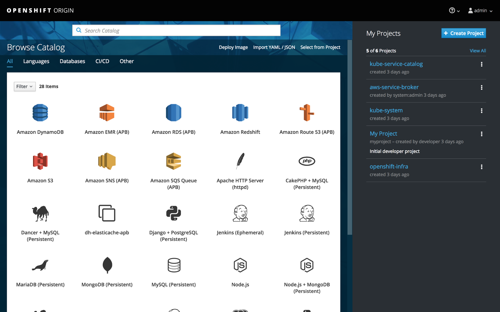
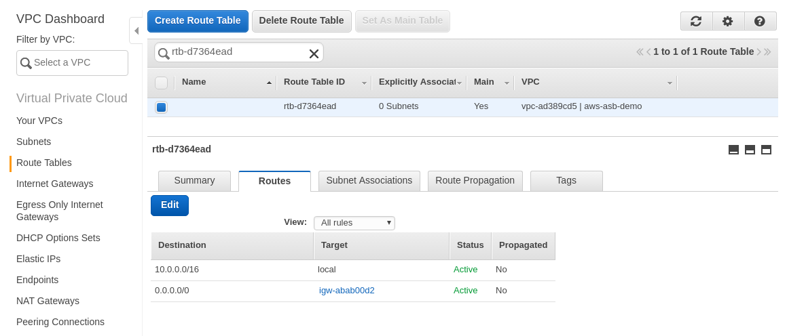

# Getting Started Guide

## Overview

This guide describes how to configure an OpenShift cluster with the capability to deploy AWS services.

### Terminology

The following terms and abbreviations are used throughout the document.

*   **Service Catalog** is the component which finds and presents the users the list of services which the user has access to. It also gives the user the ability to provision new instances of those services and provide a way to to bind the provisioned services to existing applications.
*   **Service Brokers** are the components that manages a set of capabilities in the cloud infrastructure, and provides the service catalog with the list of services, via implementing the Open Service Broker API
*   **AWS Broker** is the Red Hat's OpenShift Org's implementation of the service broker for Amazon Services.
*   **Ansible Playbook Bundle (APB)** is a application definition (meta-container) used to define and deploy applications.

### AWS Services available
After completing the steps in this guide, the following AWS services will be available from the OpenShift Service Catalog as APBs.

*   Simple Queue Service (SQS)
*   Simple Notification Service (SNS)
*   Route 53
*   Relational Database Service (RDS)
*   Elastic MapReduce (EMR)
*   Simple Cloud Storage Service (S3)
*   ElastiCache
*   Redshift
*   DynamoDB
*   Athena


## Requirements

The following are required to provision AWS services from the OpenShift Service Catalog.

*   OpenShift Container Platform (OCP) or Origin v3.7
*   Docker
*   Service Catalog
*   AWS Service Broker configured with an appropriate registry (e.g. [docker.io/awsservicebroker](https://hub.docker.com/u/awsservicebroker/dashboard/))
*   APB Prerequisites (if applicable)

Instructions below will guide you in deploying these components in production and development environments.

## Before Deploying the AWS Broker

### Create an AWS Access Key for the AWS Broker to use

The AWS Broker requires an AWS Access Key to provision AWS services. See the [AWS IAM documentation](http://docs.aws.amazon.com/IAM/latest/UserGuide/id_credentials_access-keys.html) for information on creating an Access Key.

Keep track of the created key for later in the deployment process.

### Create an IAM Role for the AWS Broker to assume

When the AWS Broker is provisioning services, it assumes an IAM Role to access CloudFormation. The AWS Access Key you've just created needs access to this CloudFormation IAM role so that the AWS Broker can assume the role for service provisioning tasks.

Follow these instructions to manually create a compatible IAM role.

1.  Login to the AWS Management Web Console
1.  Click "Services → IAM"
1.  Click "Roles" in the Left column
1.  Click "Create Role"
1.  On the "Select type of trust entity" screen, select "CloudFormation"
1.  Then click "Next: Permissions" to continue
1.  Select an appropriate permission level (select "AdministratorAccess" to give the broker full permissions)
1.  Click "Next: Review" to continue
1.  Enter the desired IAM Role Name (e.g. "aws-broker-cloudformation"), and click "Create Role"

Once you have completed creating the role, you can get its ARN by going back to the "Services → IAM" and clicking on "Roles", then selecting your newly created Role.

The role ARN will have the following format:

```
arn:aws:iam::375558675309:role/my-role-name
```

Keep track of role ARN for later during the deployment process.


## Choosing a Deployment Type

### Production

[Jump to "Production" deployment instructions.](#production-deployment-instructions)

 * For production workloads
 * Uses an [OpenShift template](https://s3.amazonaws.com/awsservicebroker/scripts/deploy-awsservicebroker.template.yaml) to deploy the AWS Broker into an existing OpenShift cluster
 * Can be quickly deployed on an existing OpenShift cluster
 * Only way to run with on-premises multi-node OpenShift cluster
 * Requires manually running the OpenShift installer
 * May require additional knowledge of OpenShift


### Development

 [Jump to "Development" deployment instructions.](#development-deployment-instructions)

 * For development and testing
 * Uses [CatASB](https://github.com/fusor/catasb) to deploy OpenShift, Service Catalog, and AWS Broker
 * Relaxed security settings by default
 * Not for production workloads
 * Provides a quick way to reset environment (OpenShift, Service Catalog, AWS Broker) to latest available.
 * Supports deploying OpenShift cluster onto AWS EC2


## Production Deployment Instructions
### Step 1: Deploy an OpenShift cluster configured to run the Service Catalog
Refer to OpenShift documentation for instructions on deploying an OpenShift 3.7 cluster.

 * [OpenShift Origin Documentation](https://docs.openshift.org/)
 * [OpenShift Container Platform Documentation](https://access.redhat.com/documentation/en-us/openshift_container_platform/)

Before proceeding to Step 2, set up the following:
 * OpenShift 3.7 cluster configured to run the Service Catalog
 * OpenShift Persistent Volume (PV) configured and available for use by AWS Broker (1 GiB recommended)

### Step 2: Add the AWS Broker to an OpenShift Cluster
#### The AWS Broker Deployment Template

The simplest way to load the AWS Broker onto an existing OpenShift cluster is with [deploy-awsservicebroker.template.yaml](https://s3.amazonaws.com/awsservicebroker/scripts/deploy-awsservicebroker.template.yaml), an OpenShift template describing the components of an AWS Broker deployment.

The AWS Broker template [deploy-awsservicebroker.template.yaml](https://s3.amazonaws.com/awsservicebroker/scripts/deploy-awsservicebroker.template.yaml) has many configurable parameters, and requires several SSL certificates.

Use the [helper script](https://s3.amazonaws.com/awsservicebroker/scripts/deploy_aws_broker.sh) described in the next section to quickly fill out the recommended values. Important template parameters are described below:

 * `DOCKERHUB_ORG` - Organization from which AWS service APB images will be loaded. Set to`"awsservicebroker"`.
 * `ENABLE_BASIC_AUTH` - Changes authentication from bearer-token auth to basic auth. Set to `"false"`.
 * `NAMESPACE` - Namespace to deploy the broker in. Set to `"aws-service-broker"`.
 * `ETCD_TRUSTED_CA_FILE` - File path of CA certificate for AWS Broker etcd store.
 * `BROKER_CLIENT_CERT_PATH` - File path of AWS Broker client certificate.
 * `BROKER_CLIENT_KEY_PATH` - File path of AWS Broker client key.

#### Using the Helper Script to Process the AWS Broker Deployment Template
The easiest way to deploy the contents of the AWS Broker deployment template is to run the [helper script](https://s3.amazonaws.com/awsservicebroker/scripts/deploy_aws_broker.sh) which will generate required SSL certificates and provide required parameters to the template.


First, create a directory containing the deployment template and helper script.
```bash
mkdir -p ~/aws_broker_install
cd ~/aws_broker_install
wget https://s3.amazonaws.com/awsservicebroker/scripts/deploy-awsservicebroker.template.yaml
wget https://s3.amazonaws.com/awsservicebroker/scripts/deploy_aws_broker.sh
```

Before running the helper script, verify that the variables near the top of the file are set correctly.
```bash
vi deploy_aws_broker.sh
```

```bash
CLUSTER_ADMIN_USER="system:admin" # OpenShift user with Cluster Administrator role.
TEMPLATE_FILE="./deploy-awsservicebroker.template.yaml" # Path to AWS Broker deploy template
DOCKERHUB_ORG=${DOCKERHUB_ORG:-"awsservicebroker"} # Dockerhub organization where AWS APBs reside.
```

Finally, run the script to deploy the AWS Broker.
```bash
chmod +x deploy_aws_broker.sh
./deploy_aws_broker.sh
```

Once the AWS Broker is deployed, it should be visible from the OpenShift namespace `"aws-service-broker"`. You should also see AWS Services appear in the OpenShift Service Catalog.

## Development Deployment Instructions

### CatASB - Introduction
[CatASB](https://github.com/fusor/catasb) is a collection of Ansible playbooks which will automate the creation of an OpenShift environment containing the Service Catalog and the AWS Broker. _Unlike_ the production deployment steps, these steps will automatically handle creation of the OpenShift cluster.

To deploy this way, you will first edit a configuration YAML file to customize the automation to your needs.

First, clone the `catasb` git repository


```bash
git clone https://github.com/fusor/catasb.git
cd catasb
```


Copy the '`my_vars.yml.example`' to '`my_vars.yml`', and edit the file.  '`my_vars.yml`' is your custom configuration file.  Any variable defined in this file will overwrite its definition anywhere else.


```bash
cd config
cp my_vars.yml.example my_vars.yml
```


**Review**, **uncomment**, and **modify** variables that you wish to customize.


```bash
vi my_vars.yml
```


Below are some of the variables that you may wish to override:


```yaml
dockerhub_org: awsservicebroker

origin_image_tag: latest
openshift_client_version: latest

deploy_asb: False
deploy_awsservicebroker: True

aws_role_arn_name: "aws-broker-cloudformation"
```

`origin_image_tag` - version of the origin to be used ([click here for the list of valid tags](https://hub.docker.com/r/openshift/origin/tags/))

`openshift_client_version` - default is "latest", should match `origin_image_tag` version.

`awsservicebroker_broker_template_dir` - location of AWS Broker Config file

`deploy_asb` - deploy Ansible Service Broker, defaults to "True"

`deploy_awsservicebroker` - deploy AWS Broker, defaults to "False"

`aws_role_arn_name` -  IAM Role Name for CloudFormation

### CatASB - Associating an AWS Access and Secret key pair for all APBs

If you wish to use only one set of AWS Access and Secret key pair for for all AWS Service APBs, you can set a few environment variables **_BEFORE_** running the CatASB scripts, and the secrets will be **_automatically_** created for the APBs to consume.

In the terminal, export the values for the AWS Access and Secret keys as shown below


```bash
$ export AWS_ACCESS_KEY_ID="<my_aws_access_key_value>"
$ export AWS_SECRET_ACCESS_KEY="<my_aws_secret_key_value>"
```

With these exported, the APBs will no longer require the user to input the Access and Secret key parameters during the APB provisioning step, since those parameter fields will not be visible.

If you wish to remove the automatically created secret later on, login to the OpenShift Console, visit ` aws-service-broker→ resources → secrets` → `aws-custom-access-key-pair` secret and select `Actions → Delete`.

**Note**: After deleting the secret, manual entry of the AWS access and secret key parameters will be required during the AWS service provisioning step.


### CatASB - Deploying to the local machine

This will do an '`oc cluster up`', and install/configure the Service Catalog with the AWS broker.

Navigate into the `catasb/local/<OS>` folder


```bash
cd catasb/local/linux  # for Linux OS

or

cd catasb/local/mac    # for Mac OS
```


If you are running in the Mac OS, review/edit `catasbconfig/mac_vars.yml`


To facilitate automatic creation of secrets for the AWS Access and AWS Secret Key parameters for all your APBs, do the following.  


```bash
export AWS_ACCESS_KEY_ID=<your access key value>
export AWS_SECRET_ACCESS_KEY=<your secret key value>
```


For more information on creating secrets for your APB parameters [Click Here]

Run the `setup` script


```bash
./run_setup_local.sh  # for Linux OS

or

./run_mac_local.sh    # for Mac OS
```


If the CatASB is successful, the script will eventually output the details of the OpenShift Cluster.


#### Troubleshooting


When visiting the cluster URL (e.g. [https://172.17.0.1:8443/console/](https://172.17.0.1:8443/console/)), you may get an issue with _not_ being able connect.  Check your firewall rules to make sure all of the OpenShift Ports are permitted. [Click here to see the list of ports](https://docs.openshift.com/container-platform/latest/install_config/install/prerequisites.html#required-ports)


Try disabling your firewall, reset your environment, and see if you can reach the cluster URL


```bash
sudo iptables -F
./reset_environment.sh
```


### CatASB - Deploying to EC2 (single-node)

This environment uses "`oc cluster up`" in a single EC2 instance, and will install the OpenShift components from RPMs.

Navigate into the `catasb/ec2 `folder


```bash
cd catasb/ec2
```


Define the following environment variable for your AWS Account


<table>
  <tr>
   <td><strong>Environment Variable</strong>
   </td>
   <td><strong>Default Values</strong>
   </td>
  </tr>
  <tr>
   <td>AWS_ACCESS_KEY_ID
   </td>
   <td>No Default
   </td>
  </tr>
  <tr>
   <td>AWS_SECRET_ACCESS_KEY
   </td>
   <td>No Default
   </td>
  </tr>
  <tr>
   <td>AWS_SSH_KEY_NAME
   </td>
   <td>splice
   </td>
  </tr>
  <tr>
   <td>TARGET_DNS_ZONE
   </td>
   <td>ec2.dog8code.com
   </td>
  </tr>
  <tr>
   <td>OWNERS_NAME
   </td>
   <td>whoami
   </td>
  </tr>
  <tr>
   <td>TARGET_SUBDOMAIN
   </td>
   <td>${OWNERS_NAME}
   </td>
  </tr>
  <tr>
   <td>AWS_SSH_PRIV_KEY_PATH
   </td>
   <td>No Default
   </td>
  </tr>
</table>


Setup the AWS network, and the EC2 instance:


```bash
./run_create_infrastructure.sh
```


The script will output the details of the AWS environment

Next, install and configure OpenShift, service catalog, and the broker


```bash
./run_setup_environment.sh
```


To terminate the EC2 instance and to remove/clean-up the AWS network, run the following


```bash
./terminate_instances.sh
```


All of the scripts above will output the details of the OpenShift Cluster.  However, if you wish to review those details at any time, you can run the following:


```bash
./display_information.sh
```


### CatASB - OpenShift Web Console Login

When you visit the cluster URL  ([https://172.17.0.1:8443/console/](https://172.17.0.1:8443/console/) is default for local CatASB) you should see a login screen as shown below.  The default login for CatASB is `admin` username with `admin` password.



After login, you will be greeted with the following main screen.




## Using Secrets to Hide Parameters from Service Catalog Users

Many of the AWS Service APBs share a common set of required parameters (e.g. `AWS Access Key`, `AWS Secret Key`, `CloudFormation Role ARN`, `Region`, `VPC ID`) which a cluster administrator may want to hide from the user for security or simplicity purposes. Using AWS Broker secrets, cluster administrators can hide chosen parameters, and instead opt to manually designate preset values per-service or in general.  

To hide selected AWS Service parameters from Service Catalog users, a cluster administrator must create secret(s) in the 'aws-service-broker' namespace.  Once secrets containing parameter presets are created and associated with an APB, those parameters will NOT appear during the normal APB's launching process.  This means that the user will not even "see" that parameter option to enter the value for, since they have already been set and created as a secret.  Those parameter values will automatically be filled with values created in the secret.

Follow the steps below to manually create and configure secrets for your APBs. When deploying with CatASB, secrets containing the `AWS Access Key` and `AWS Secret Key` will be created automatically if appropriate environment variables are set before running.

### Manually Creating Secrets to Autofill AWS Service Parameters

Let's consider a scenario in which you haven't yet set `AWS_ACCESS_KEY_ID` or `AWS_SECRET_ACCESS_KEY` as AWS Broker secrets, and that you wish to create an appropriate secret now so that users provisioning services won't have to know these details.

Start by creating a secrets file. The following snippet shows example contents of a secret-containing YAML file, `aws-secret.yml`.


```yaml
---
apiVersion: v1
kind: Secret
metadata:
  name: aws-secret
stringData:
  aws_access_key: "changeme"
  aws_secret_key: "changeme"
```


**Note**:  The named values (`aws_access_key` and `aws_secret_key`) in the snippet's `stringData` section **MUST** be equal to the parameter names inside of the AWS Service APB that you wish to receive the secret value.  If the names do not match exactly, the parameter values will NOT receive the secret.

Next, create the secret in the "`aws-service-broker`" namespace

```bash
oc create -f aws-secret.yml -n aws-service-broker
```

You may create as many AWS Broker secrets as you like. Simply repeat these steps for each secret.

You can verify that the secrets were created in the OpenShift Web Console by visiting the `resource → secrets` section in the `aws-service-broker` namespace.

Now, we want to configure our broker to _use_ the secret that we just created in "`aws-secret`" and configure them to be consumed by our APBs.  

To do so, edit the broker's `configmap` by issuing the following command


```bash
oc edit configmap -n aws-service-broker
```


Search for the following section of the `configmap`


```yaml
   broker:
      dev_broker: True
      bootstrap_on_startup: true
      refresh_interval: "24h"
      launch_apb_on_bind: False
      output_request: False
      recovery: True
      ssl_cert_key: /etc/tls/private/tls.key
      ssl_cert: /etc/tls/private/tls.crt
      auto_escalate: True
      auth:
        - type: basic
          enabled: False
```


And …

Add in a "**<code>secrets</code></strong>" section which follows the following syntax.


```yaml
    secrets:
      - {apb_name: dh-myAPB, secret: aws-secret, title: aws-secret}
```


The `"apb_name"` will follow the above pattern

*   "`dh`" for dockerhub
*   `"secret/title"` is the name of your secret.

The modified configmap will look as follows:


```yaml
    broker:
      dev_broker: True
      bootstrap_on_startup: true
      refresh_interval: "24h"
      launch_apb_on_bind: False
      output_request: False
      recovery: True
      ssl_cert_key: /etc/tls/private/tls.key
      ssl_cert: /etc/tls/private/tls.crt
      auto_escalate: True
      auth:
        - type: basic
          enabled: False
    secrets:
      - {apb_name: dh-sqs-apb, secret: aws-secret, title: aws-secret}
      - {apb_name: dh-sns-apb, secret: aws-secret, title: aws-secret}
      - {apb_name: dh-r53-apb, secret: aws-secret, title: aws-secret}
      - {apb_name: dh-rds-apb, secret: aws-secret, title: aws-secret}
      - {apb_name: dh-emr-apb, secret: aws-secret, title: aws-secret}
      - {apb_name: dh-redshift-apb, secret: aws-secret, title: aws-secret}
      - {apb_name: dh-elasticache-apb, secret: aws-secret, title: aws-secret}
      - {apb_name: dh-dynamodb-apb, secret: aws-secret, title: aws-secret}
      - {apb_name: dh-s3-apb, secret: aws-secret, title: aws-secret}
      - {apb_name: dh-athena-apb, secret: aws-secret, title: aws-secret}
```

To make our edits take effect, **restart** the broker's `asb` pod


```bash
oc rollout latest aws-asb -n aws-service-broker
```


Change the default `broker-relist-interval` value of the service catalog's `controller-manager` pod by editing its deployment


```bash
oc edit deployment controller-manager -n kube-service-catalog
```


Search for the following section


```yaml
    spec:
      containers:
      - args:
        - -v
        - "5"
        - --leader-election-namespace
        - kube-service-catalog
        - --broker-relist-interval
        - 5m
```


And …

Edit the `broker-relist-interval` value to <code>1m<strong> </strong></code>as shown below


```yaml
    spec:
      containers:
      - args:
        - -v
        - "5"
        - --leader-election-namespace
        - kube-service-catalog
        - --broker-relist-interval
        - 1m
```


The controller-manager pod will _automatically_ restart once you_ save and exit_ the deployment edit screen.**<code> </code></strong>

Review the `asb` pod's _logs_ in the `aws-service-broker` namespace. The logs should show  "`filtering secrets`" for the APB's that you have configured the secrets for.


```bash
[DEBUG] Filtering secrets from spec dh-sqs-apb
```


## General APB Tips

Create a new project (namespace) to provision each of the APBs, unless it make sense to do otherwise.

All AWS APBs require the `aws_access_key` and the `aws_secret_key` parameters.  Therefore, these two parameters would be a great candidates for the creating of the secrets and configure the APB's to use them via defining the  the `AWS_ACCESS_KEY_ID` and the `AWS_SECRET_ACCESS_KEY` environment variable as described earlier.

Most APB parameters have default values and are descriptive enough to make an educated guess on what the values should be. Many parameters are selectable from a set of valid choices.  However, if any of the parameters do not make sense, do not provision.  Click the "view documentation" and review the AWS service documentation when you're not certain what the parameters should be.


### Binding

#### Provision first, Bind Later

If you simply want to provision the APB and wish to bind it to an application at a later time, do the following


*   Provision the APB, but select "do not create a binding"
*   Provision other apps or APBs, but again, select "do not create binding"
*   Once all of the APB's/Apps are provisioned in your namespace, select an app, and create the binding from the App to the APB and ...
*   Redeploy your app if it does not automatically redeploy after binding. Some `source-to-image` apps may need to be manually redeployed


#### Bind During the Provisioning Step

To bind applications to APB during the provisioning step, you must already have an App or an APB that was successfully provisioned. Once you have an APB to bind to, do the following


*   Provision the APB, but select "create a binding to be used later"
*   Provision apps, but do not bind the apps to the APB
*   Go to the the "resources → secrets" and find and click on the `binding secret`
*   Click on the "`Add to application`" at the top right, and select your application
*   Redeploy your app if it does not automatically redeploy


## General Troubleshooting

### Debugging connectivity issues from external traffic to VPC

We've run into some cases with RDS where the connection to the RDS instance was not accessible.  When this happens look at the VPC of the RDS instance and trace to the associated routing table.  Verify that the routing table has a reference to the internet gateway, if you don't see a reference to the igw like below then add it so external traffic is allowed.


